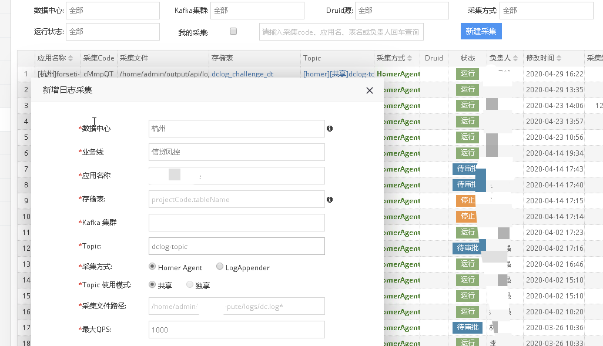

## 数据采集平台
从kafka 中消费数据写入hive表中，一般第一想到就是用spark，flink消费数据写入hive表中，一般规模场景下，方案很重。如果需要采集应用日志很多，启动的spark/flink任务相应也很多，

dzlog不依赖spark/flink，是一个spring boot 应用，基于spring kafka 同时消费多个topic并发消费数据，无中心节点，可以随时启动一个新节点，满足消费速度，每一个topic消费数据先在本地生成parquet文件，按照最大数量或者时间定时上传到表分区目录中。
可以平台化实现数据采集能力，基于dc_log_collect_config 表开发一个管理页面。

现在依赖用户主动把数据写入kafka，可以和filebeat结合，打通采集流程，用户只需要使用logger把数据写入日志文件，通过filebeat采集数据写入kafka，上家公司就是这么实现的，需要配套完整基建落地，只需要通过表单填写应用名称、采集路径、采集频率等信息，审批通过后自动通知下发给应用所有的服务器采集数据。



## dzlog 规则
1. 每十五分钟一个分区(00, 15, 30, 45)，按照消息接收时间写入对应分区。
2. 当前写入分区，对用户不可见，切换到下个分区执行: ALTER TABLE ADD PARTITION
3. 只写入原始数据，不做解析，用户单独跑ETL任务解析数据。
4. 支持parquet、hudi(待开发) 两种格式。
5. 依赖redis 选举leader，主要用于监控线程，非主流程必要功能。

## 打包运行

依赖bee 中BeeConfigClient 类，可以二次开发去掉依赖: https://gitee.com/melin/bee

```
mvn clean package -Pproduction
```
target生成 dzlog-1.0-SNAPSHOT.tar.gz 部署包，解压包，执行脚本启动服务

```
./bin/server.sh start
```

## 采集配置建表脚本
```sql
CREATE TABLE dc_log_collect_config (
    `id` int(11) NOT NULL AUTO_INCREMENT COMMENT 'Id',
    `code` varchar(128) DEFAULT NULL COMMENT 'code',
    `data_center` varchar(128) DEFAULT NULL COMMENT '数据中心',
    `app_name` varchar(128) DEFAULT NULL COMMENT '应用名',
    `database_name` varchar(128) NOT NULL COMMENT '数据库',
    `table_name` varchar(128) NOT NULL COMMENT '表名',
    `collect_file` varchar(256) NOT NULL COMMENT '采集文件路径',
    `kafka_cluster` varchar(45) NOT NULL COMMENT 'Kafka cluster',
    `kafka_topic` varchar(45) NOT NULL COMMENT 'Kafka topic',
    `flow_status` int(1) NOT NULL DEFAULT '0' COMMENT '1：审核通过，2：暂停、0: 待审核',
    `run_status` int(1) NOT NULL DEFAULT '0' COMMENT '1：启动，2：暂停、0：停止',
    `gmt_created` datetime DEFAULT NULL COMMENT '创建时间',
    `gmt_modified` datetime DEFAULT NULL COMMENT '更新时间',
    `creater` varchar(45) DEFAULT NULL COMMENT '创建人',
    `modifier` varchar(45) DEFAULT NULL COMMENT '更新人',
    PRIMARY KEY (`id`),
    UNIQUE KEY `uk_code` (`code`)
) ENGINE=InnoDB DEFAULT CHARSET=utf8mb4 COMMENT='采集服务器信息';

CREATE TABLE `dc_dc_log_collect_metric` (
    `id` int(11) NOT NULL AUTO_INCREMENT COMMENT 'Id',
    `node_ip` varchar(128) DEFAULT NULL COMMENT '采集节点IP',
    `code` varchar(45) NOT NULL COMMENT '采集code',
    `collect_date` varchar(45) NOT NULL COMMENT '采集日期：yyyyMMdd',
    `hour_period` varchar(16) DEFAULT NULL COMMENT '小时',
    `minute_period` varchar(16) DEFAULT NULL COMMENT '分钟',
    `minute_count` int(11) DEFAULT NULL COMMENT '分钟消息数量',
    `minute_bytes` int(11) DEFAULT NULL COMMENT '分钟消息大小',
    `gmt_created` datetime DEFAULT NULL COMMENT '创建时间',
    `gmt_modified` datetime DEFAULT NULL COMMENT '更新时间',
    `creater` varchar(45) DEFAULT NULL COMMENT '创建人',
    `modifier` varchar(45) DEFAULT NULL COMMENT '更新人',
    PRIMARY KEY (`id`),
    KEY `idx_code` (`code`)
) ENGINE=InnoDB DEFAULT CHARSET=utf8mb4 COMMENT='采集服务器信息';

CREATE TABLE `dc_config` (
    `id` int(11) NOT NULL AUTO_INCREMENT,
     `appname` varchar(64) NOT NULL,
     `profile` varchar(64) NOT NULL,
     `config_text` longtext,
     `version` int(11) DEFAULT '0' COMMENT 'version',
     `creater` varchar(45) NOT NULL,
     `modifier` varchar(45) DEFAULT NULL,
     `gmt_created` datetime NOT NULL,
     `gmt_modified` datetime DEFAULT NULL,
     PRIMARY KEY (`id`),
     UNIQUE KEY `appname_UNIQUE` (`appname`,`profile`)
) ENGINE=InnoDB DEFAULT CHARSET=utf8mb4 COMMENT='系统参数配置';
```
